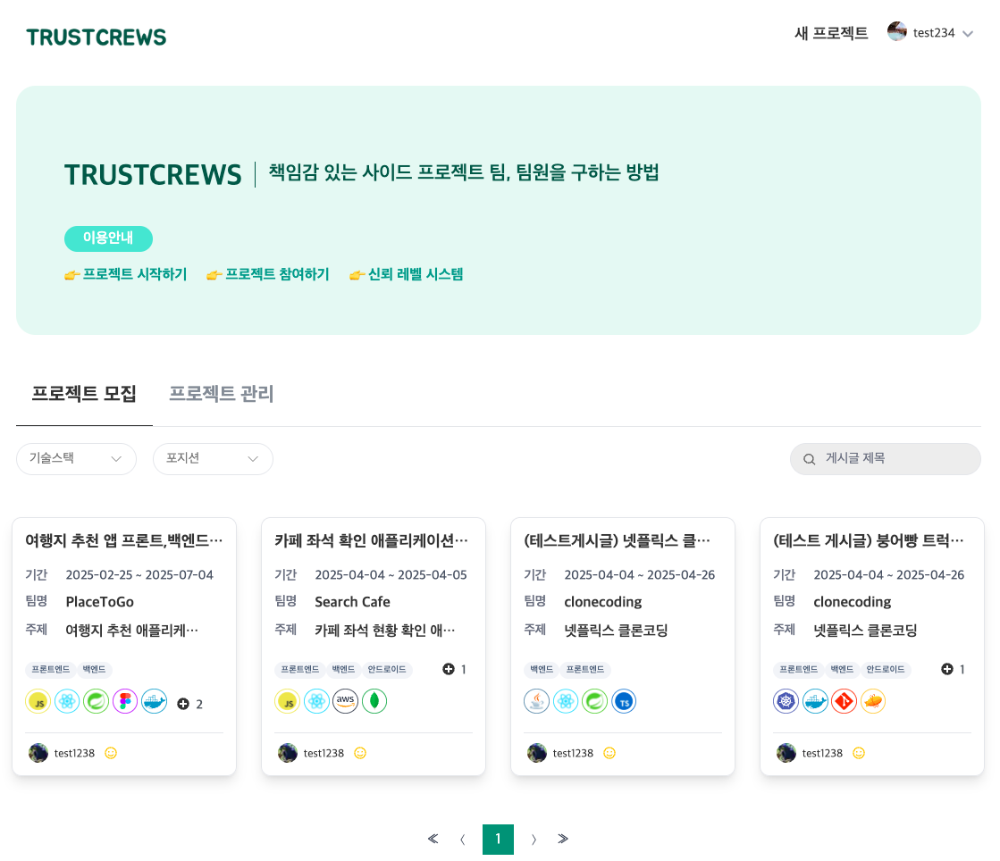
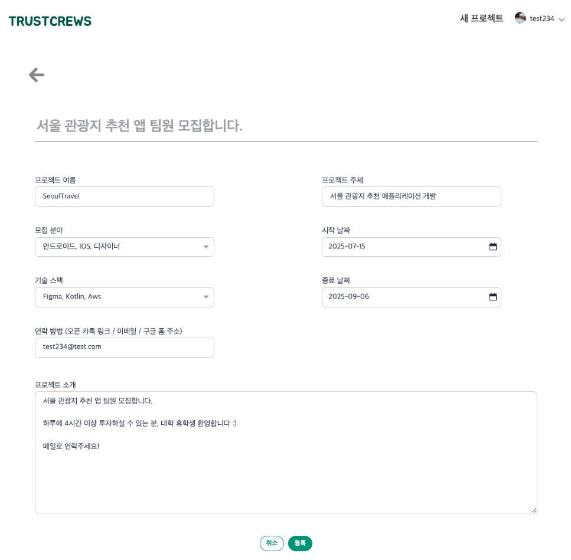
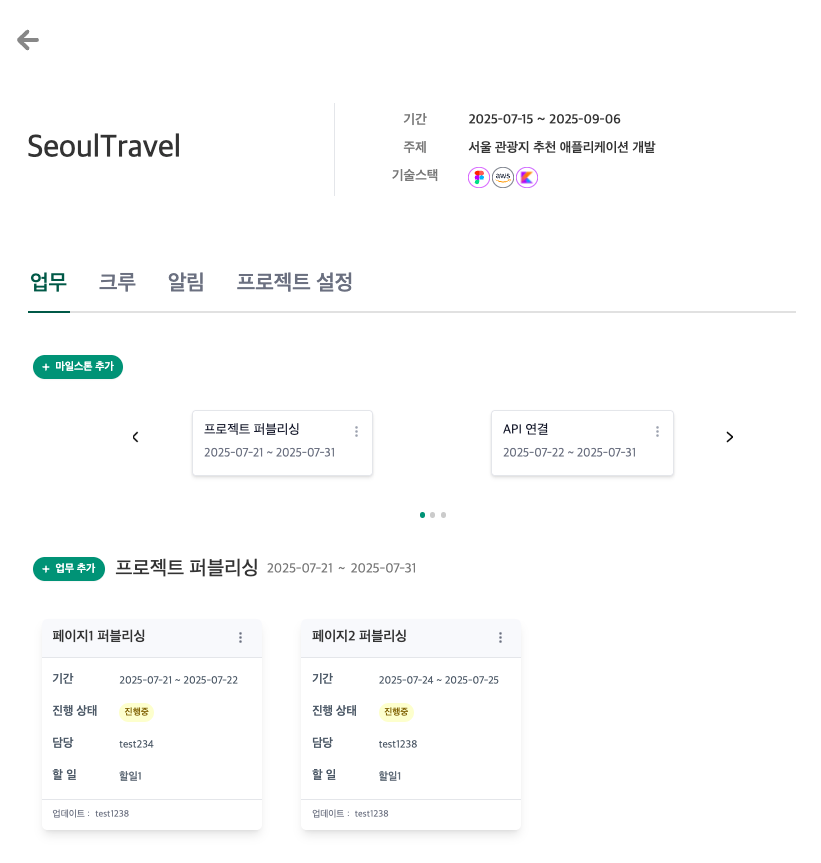
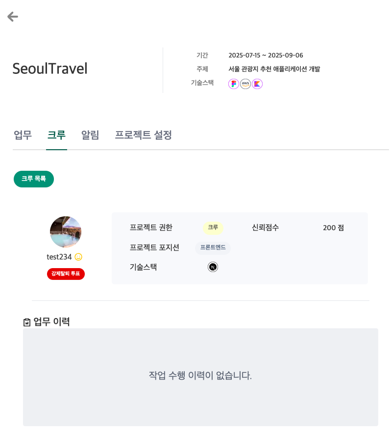
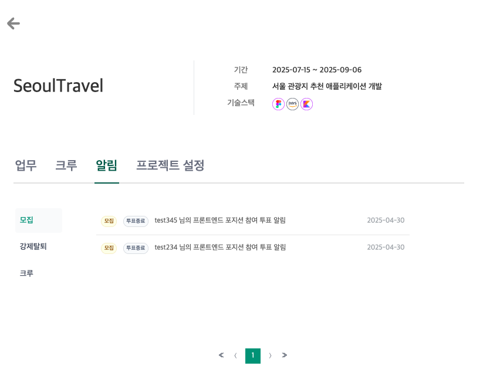
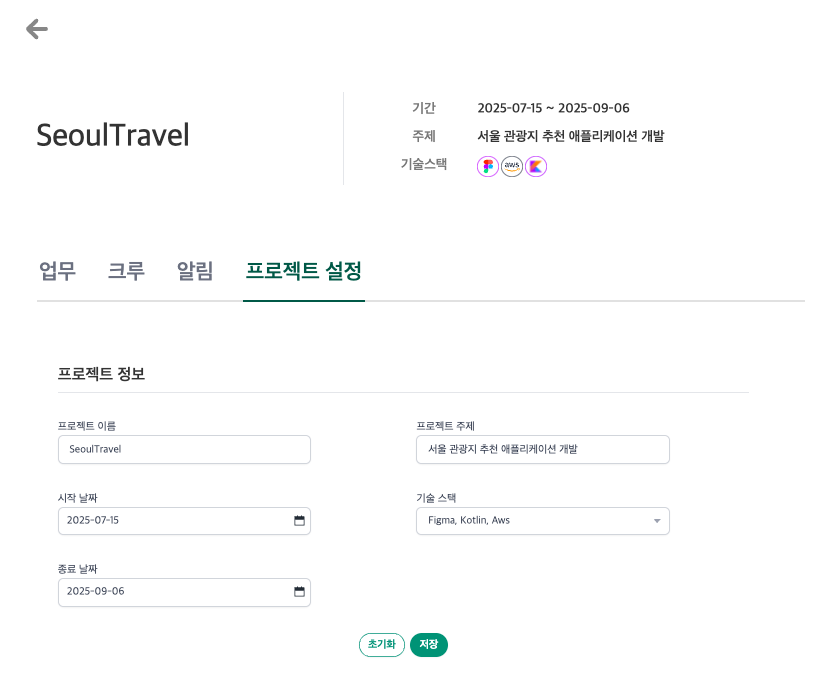
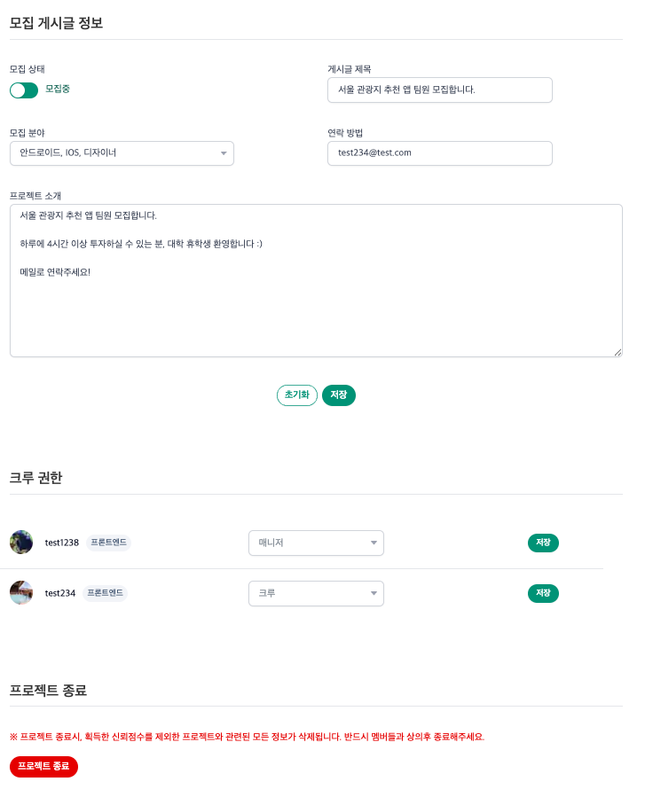

<br/>

# TRUSTCREWS 소개

- 다양한 개발 직군, 프로그래밍 언어별로 개설된 **사이드 프로젝트**에 참여하거나, 직접 프로젝트를 개설하여 **팀원을 모집**할 수 있는 사이트 입니다.
- 사이드 프로젝트의 **업무**와 **팀원**을 관리할 수 있으며, **팀원 강제탈퇴 시스템**, 프로젝트 업무 수행을 통해 포인트를 얻는 **신뢰점수 시스템** 등 다양한 방법으로
  **책임감 있는** 사이드 프로젝트 운영을 돕습니다.

<br/>
<br/>

# Frontend Info

<br/>

### 멤버

[EUNSUN23](https://github.com/EUNSUN23) (2023.11 ~ ), [moa1128](https://github.com/orgs/oneMonthProject/people/moa1128) (2023.11 ~ 2024.01)

<br/>

### 기술스택

JavaScript, TypeScript, React (Hook), Next.js 14, Tanstack-Query, Recoil, Tailwind CSS, Github Actions, Vercel

<br/>

## 프로젝트 구조

```text
src
├── app
├── constants
├── features
├── hooks
├── layouts
├── lib
├── providers
├── shared
├── store
├── types
├── apiMiddleware.ts
└── middleware.ts
```

- **`shared`** : 프로젝트에 종속되지 않는 재사용 가능 소스 <br/>
- **`lib`** : 프로젝트 라이브러리 소스 <br/>
- **`constants`**, **`hooks`**, **`store`**, **`types`**, **`providers`** : 프로젝트에서 사용하는 constant, hook, store,  type, provider <br/>
- **`features`** : 애플리케이션 핵심 기능 <br/>
- **`apiMiddleware.ts`** : 라우트핸들러 요청을 처리하는 미들웨어
- **`middleware.ts`** : 앱라우터 요청을 처리하는 미들웨어

<br/>

## 프로젝트 실행

<br/>

**`.nvmrc`에 기재된 Node.js 버전 설치**

```bash
nvm install 
nvm use
```

<br/>

**프로젝트 패키지 설치**

```bash
npm i
```

<br/>

**프로젝트 개발모드 실행**

```
npm run dev
```

<br/>
<br/>

# Site Overview

<aside>

<br/>

#### 📌 자세한 가이드는 사이트 첫 페이지의 이용안내를 참고해주세요.

<br/>

</aside>

## 팀 프로젝트 찾기

<br/>

> ### 기술스택 / 포지션 / 제목 검색을 통해 팀 프로젝트 모집글을 찾을 수 있습니다.



<br/>

## 팀 프로젝트 개설 & 모집

<br/>

> ### 프로젝트를 개설하고, 멤버를 모집할 수 있습니다.



<br/>

## 팀 프로젝트 관리

<br/>

> ### 프로젝트의 할일과 멤버, 설정을 관리할 수 있습니다.










<br/>
<br/>


