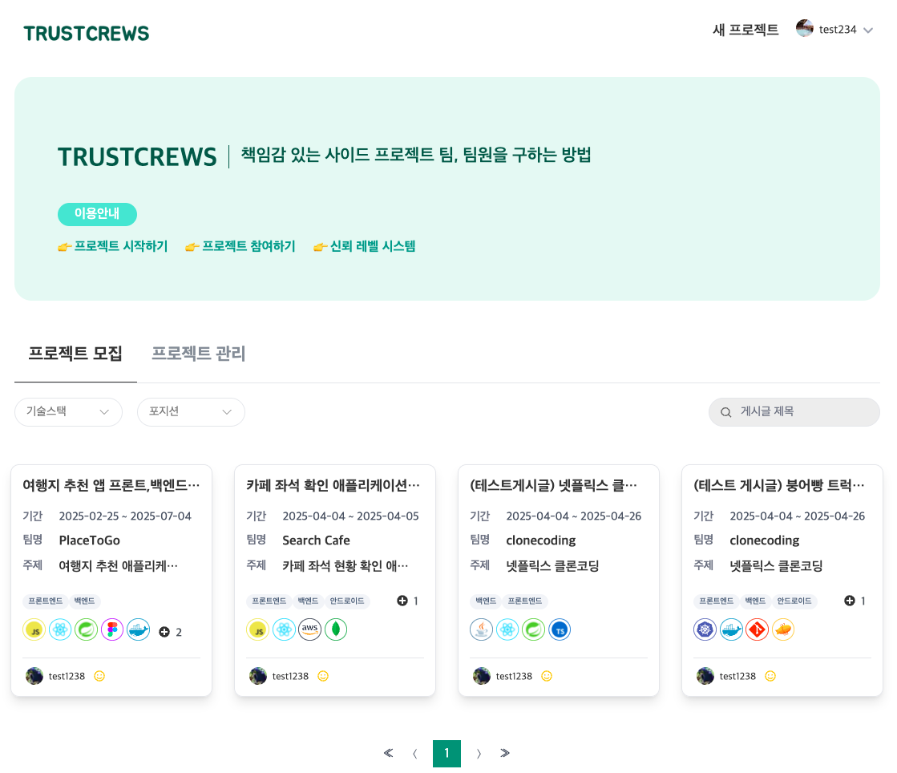
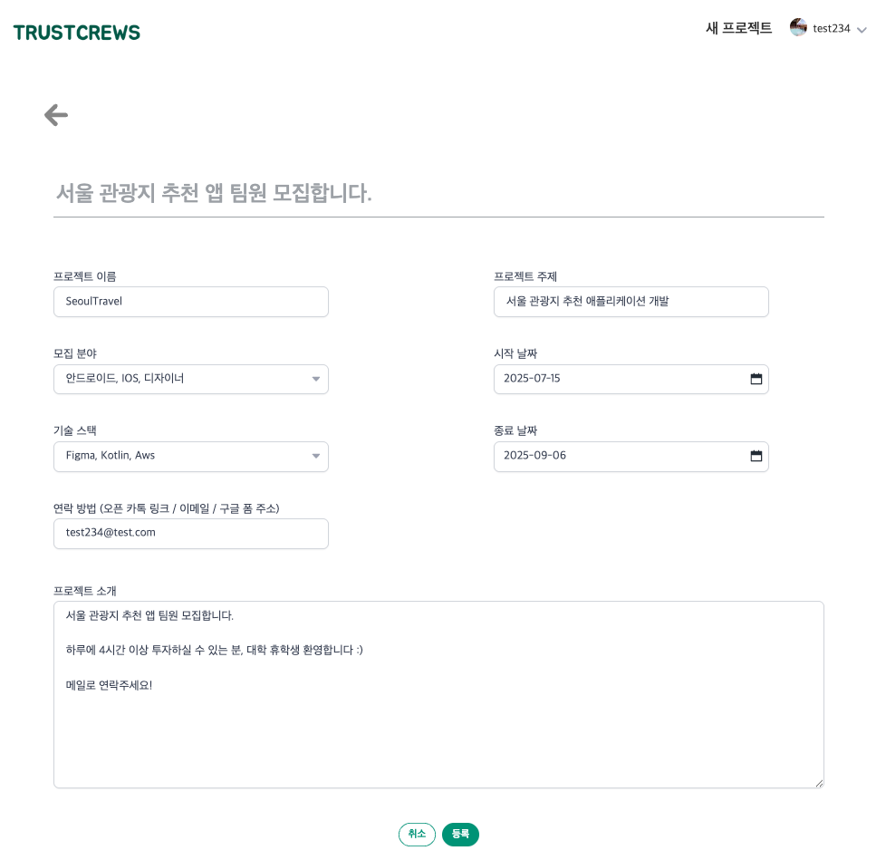
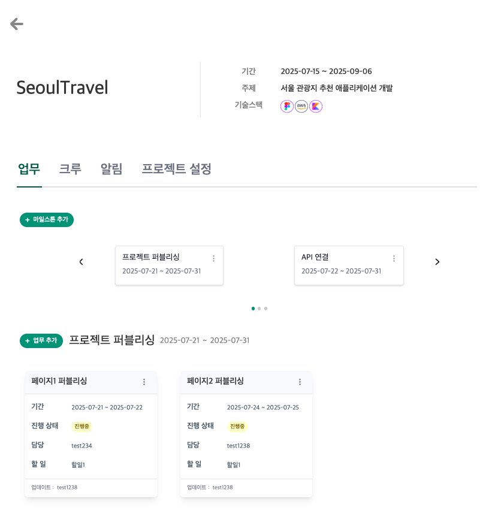
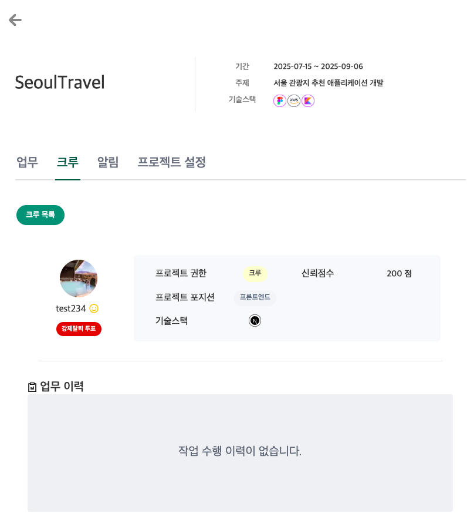
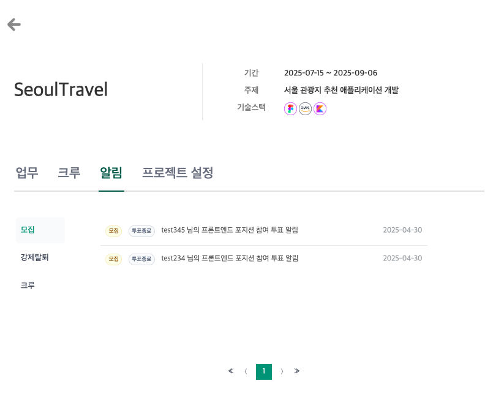
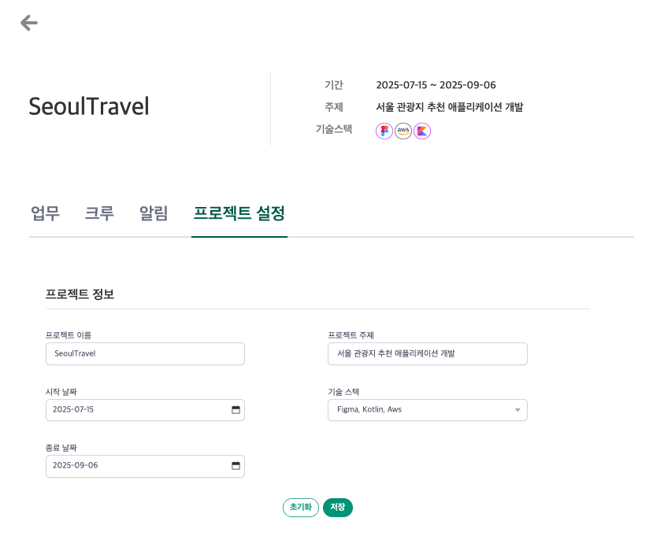
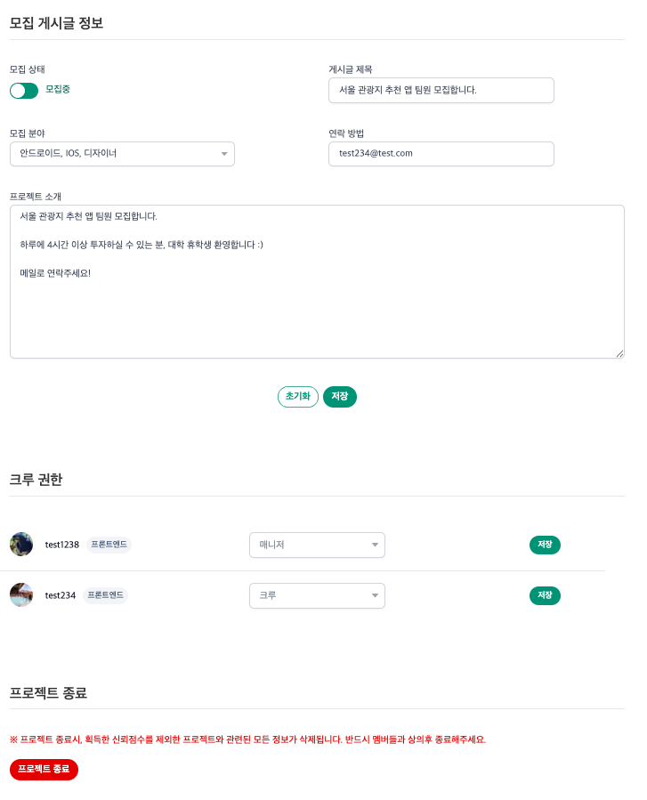

<br/>

# TRUSTCREWS 소개

- 다양한 개발 직군, 프로그래밍 언어별로 개설된 **사이드 프로젝트**에 참여하거나, 직접 프로젝트를 개설하여 **팀원을 모집**할 수 있는 사이트 입니다.
- 사이드 프로젝트의 **업무**와 **팀원**을 관리할 수 있으며, **팀원 강제탈퇴 시스템**, 프로젝트 업무 수행을 통해 포인트를 얻는 **신뢰점수 시스템** 등 다양한 방법으로
  **책임감 있는** 사이드 프로젝트 운영을 돕습니다.

<br/>
<br/>

# Site Overview

<aside>

<br/>

#### 📌 자세한 가이드는 [사이트](https://www.trustcrews.com/) 첫 페이지의 이용안내를 참고해주세요.

<br/>

</aside>

## 팀 프로젝트 찾기

<br/>

> ### 기술스택 / 포지션 / 제목 검색을 통해 팀 프로젝트 모집글을 찾을 수 있습니다.



<br/>

## 팀 프로젝트 개설 & 모집

<br/>

> ### 프로젝트를 개설하고, 멤버를 모집할 수 있습니다.



<br/>

## 팀 프로젝트 관리

<br/>

> ### 프로젝트의 할일과 멤버, 설정을 관리할 수 있습니다.










<br/>
<br/>

# Frontend Info

<br/>

### 멤버

[EUNSUN23](https://github.com/EUNSUN23), [moa1128](https://github.com/orgs/oneMonthProject/people/moa1128)(2023.11 ~ 2024.01)

<br/>

### 기술스택

JavaScript, TypeScript, React (Hook), Next.js 14, Tanstack-Query, Recoil, Tailwind CSS, Github Actions, Vercel

<br/>

## 프로젝트 구조

```text
src
├── app                 
├── entities            
├── features
│   ├── composite           
│   └── core              
├── lib                 
├── shared              
├── apiMiddleware.ts    # 라우트 핸들러 middleware
└── middleware.ts       # 페이지 middleware
```
### 소스 의존 방향 (app ➡️ shared) 


- **`app`**:  UI 페이지(View) + Route Handlers(BFF)
- **`features/composite`**: 여러 도메인 Use case가 결합된 화면 단위
- **`features/core`**: 도메인 Use cases - UI, fetch API, 비즈니스 규칙
- **`entities`**: 순수 도메인 모델/타입
- **`lib`**: 기술/환경 기반 로직 (error boundary 등)
- **`shared`**: 도메인과 무관한 범용 UI · utils 

#### 설정: .esnlintrc.josn